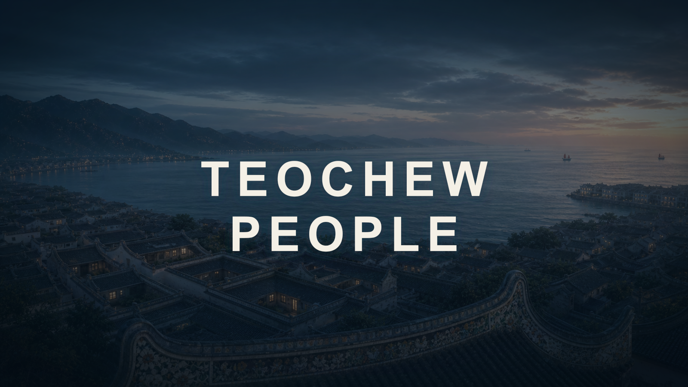

<p align="center">
  
</p>

<h1 align="center">TEOCHEW PEOPLE</h1>

<p align="center">
  <strong>自我演進、個人化的潮汕文化 Skill 與 LLM Wiki</strong><br>
  精選來源、建設可追溯主題，為文章、口播和影片製作準備真正可用的文化細節。
</p>

<p align="center">
  <a href="https://github.com/oOtiti/teochew-people-skill/actions/workflows/ci.yml"></a>
  <a href="https://www.npmjs.com/package/teochew-people-skill"></a>
  =18" src="https://img.shields.io/badge/Node.js-%3E%3D18-339933?logo=nodedotjs&logoColor=white">
  <a href="LICENSE"></a>
  
  
  
  
</p>

<p align="center">
  <a href="README.md">简体中文</a> · <strong><a href="README.zh-Hant.md">繁體中文</a></strong> · <a href="README.en.md">English</a> · <a href="README.ja.md">日本語</a>
</p>

<p align="center">
  <a href="skills/teochew-people-skill/wiki/index.md"><strong>進入公共 WIKI</strong></a> ·
  <a href="examples/letter-to-grandma-feature.md">閱讀圖文專題</a> ·
  <a href="examples/letter-to-grandma-video-scripts.md">查看影片腳本</a> ·
  <a href="#快速安裝">快速安裝</a>
</p>

## 這是什麼

TEOCHEW PEOPLE 以 55 條可追溯 raw 來源、50 張主題頁和 9 個分類索引構成公共知識底座。經審核的新資料讓 Wiki 持續成長；經你明確同意的受眾、家庭說法和表達偏好讓輸出愈用愈貼合，但一次回答或私人經驗不會被自動寫成公共真理。

TEOCHEW PEOPLE 不是把一整個資料夾塞給模型的靜態百科。它先用 [`raw/`](skills/teochew-people-skill/raw/index.md) 保存來源身分、層級、可支持論斷和限制，再用 [`wiki/`](skills/teochew-people-skill/wiki/index.md) 建設主題頁、分類索引和生產細節。topic 的 `source_ids` 可以回到 raw；不採用的資料也會在 `source-review.md` 留下理由。

| 組成 | 主要內容 | 如何持續變好 |
| --- | --- | --- |
| 公共 Wiki | 地域、語言、禮俗、飲食、藝術、僑鄉、人物組織與當代事件 | 新資料先審來源與直接性，再進 raw 和 topic |
| 自我演進 | `research → ingest → evolve → lint` | 只沉澱經確認且可長期重用的更新，不從每次對話自動學習 |
| 個人化 | project／user local vault | 經明確同意後保存受眾、選例、家庭說法與語氣，不覆蓋公共事實 |
| 寫作與影片製作 | 文章、口播、分鏡、畫面、聲音、動作、器物、空間、時間碼 | 同一證據鏈可反覆改寫、剪輯和審校 |


<p align="center"><sub>原創編輯視覺，非具體演出現場；服飾、臉譜與動作不對應單一隊伍或固定儀式。</sub></p>

## 為什麼需要來源層與主題層

- `raw/` 回答「這個來源是誰發布、何時發布、能證明多遠」。
- `wiki/` 回答「模型應先讀哪個主題、哪些地方有差異、哪些仍未知」。
- A／B／C 分級不是知名度排名；核心事實優先使用直接官方、檔案、法規或研究材料。
- Wikipedia、百度百科和搜尋摘要只用來找線索，不自動成為核心證據。
- `verified`、`synthesis`、`varies`、`unknown` 分開表達；一個村落或家庭的做法不外推為所有潮汕人。

因此，[拜老爺](skills/teochew-people-skill/wiki/customs/拜老爷.md)與[營老爺](skills/teochew-people-skill/wiki/customs/营老爷.md)分開建頁，[潮州古城申遺狀態](skills/teochew-people-skill/wiki/current-events/潮州古城申遗边界-2026.md)也不會把「推進申報」寫成「已經入選」。

## 它如何自我演進

六個操作入口構成可審計維護鏈：

| 操作 | 用途 | 邊界 |
| --- | --- | --- |
| [ingest](skills/teochew-people-skill/operations/ingest.md) | 收錄候選來源 | 先判發布者、獨立性和可支持範圍 |
| [media ingest](skills/teochew-people-skill/operations/media-ingest.md) | 處理影片、音訊、圖片 | 先判權利，再取必要時間碼；公開可看不等於可重用 |
| [query](skills/teochew-people-skill/operations/query.md) | 回答、寫作、審校、製作 | 從索引開始，按需回查 raw |
| [research](skills/teochew-people-skill/operations/research.md) | 補空缺、查衝突和熱點 | 當前狀態即時核驗 |
| [evolve](skills/teochew-people-skill/operations/evolve.md) | 持久更新 | 公共事實與本地知識分層寫入 |
| [lint](skills/teochew-people-skill/operations/lint.md) | 發布前檢查 | 驗證欄位、斷鏈、新鮮度和索引 |

「演進」不等於系統自動掌握真相。來源判斷與地方邊界仍由可復查的人類決策，確定性工具只負責索引和結構檢查。

## 寫作與影片效果展示


<p align="center"><sub>非歷史照片、非電影劇照、非真實僑批複製件。</sub></p>

《給阿嬤的情書》示範把電影備案與傳播、主創自述、僑批檔案、潮語差異和馬新放映節點拆成不同證據層，再用 7 個 `editorial_original` 視覺完成內容，不複製電影劇照、片段、台詞或音樂。

- [圖文專題《一封信，穿過海》](examples/letter-to-grandma-feature.md)：約 4,100 個漢字、6 個視覺單元。
- [60 秒與約 3 分鐘影片腳本](examples/letter-to-grandma-video-scripts.md)：口播、時間碼、鏡頭、聲音、來源、權利和當地核驗項。
- [新華社影片轉 Wiki 演示](examples/video-to-wiki-demo.md)：只保存 URL、必要時間碼與準確轉述，不保存 MP4 或完整逐字稿。
- [媒體清單](assets/media-manifest.json)：本地視覺皆為原創編輯素材；外部電影、新聞和檔案媒體維持 `link_only`。

## 個人化如何工作

解析順序是 `<project>/.teochew-people` → `~/.teochew-people` → bundled public wiki。

- project 層：當前專案的受眾、選例與表達限制。
- user 層：經明確同意的語氣、家庭說法和已授權本地材料。
- public 層：可發布、可追溯的共同事實底座。

本地層可以要求優先揭陽案例或使用本家稱謂，但不能靜默改寫公共事實。家庭照片、舊信、錄音和影片預設只留在 local overlay；公開、匿名、內部校對或不留存須逐項選擇。

## 快速安裝

Codex：

```bash
npx teochew-people-skill --codex --no-vault
```

Claude Code：

```bash
npx teochew-people-skill --claude --no-vault
```

自訂 skills 目錄：

```bash
npx teochew-people-skill --dest /path/to/skills --no-vault
```

明確同意建立個人化層後才執行：

```bash
npx teochew-people-skill --codex --init-vault
npx teochew-people-skill --codex --init-project /path/to/project
```

若 npm registry 尚未發布本頁版本，可用 GitHub：`npx github:oOtiti/teochew-people-skill --codex --no-vault`。

## 使用範例

```text
使用 $teochew-people-skill，解釋拜老爺和營老爺的區別，寫成 60 秒口播。每個事實提供 topic/raw ID，不把地方個案外推，鏡頭標 source_detail 或 editorial_structure。
```

```text
使用 $teochew-people-skill，為揭陽家庭受眾寫工夫茶文章。公共事實沿 topic/raw 核對；本家做法只放本地層，不寫回公共 Wiki。
```

更多修訂範例見 [Before / After](examples/before-after.md)。

## 知識結構

```text
skills/teochew-people-skill/
├── SKILL.md                 # 薄路由器
├── raw/                     # 55 條准入來源與審查帳本
├── wiki/                    # 50 張 topic、9 個分類
├── operations/              # ingest/media-ingest/query/research/evolve/lint
├── scripts/                 # 索引、lint、狀態與 vault 工具
├── assets/vault-template/   # 私有層模板，不含使用者資料
├── wiki-purpose.md
├── wiki-schema.md
└── wiki-log.md
```

## 貢獻、驗證與授權

貢獻採 source-first：先把候選來源及採用／拒絕理由寫入 `raw/source-review.md`，採用後建立 raw，最後更新 topic。閱讀 [CONTRIBUTING.md](CONTRIBUTING.md) 後執行：

```bash
npm run wiki:index:check
npm run wiki:lint
npm run media:check
npm test
npm run pack:check
```

程式與專案內容採 [MIT License](LICENSE)；外部來源、圖片、影片、音樂及現場素材仍受原權利與許可約束。私有 vault、project overlay、測試證據和媒體副本不進 npm 套件。
