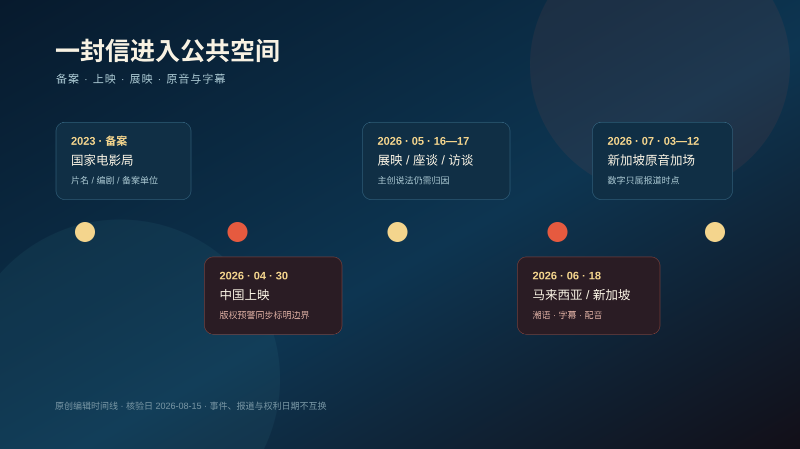
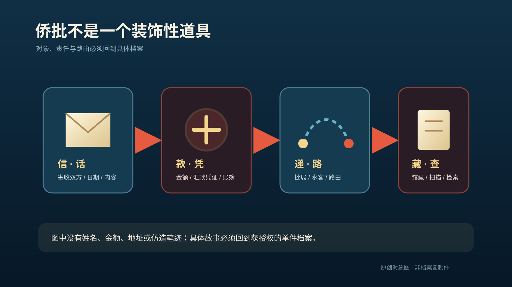
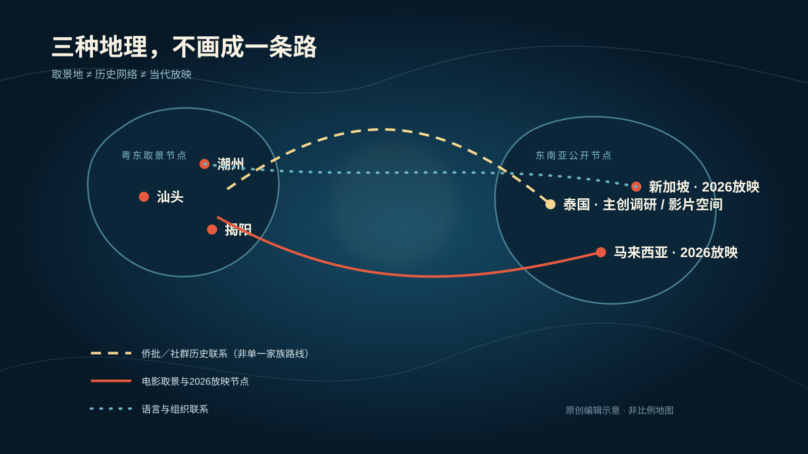
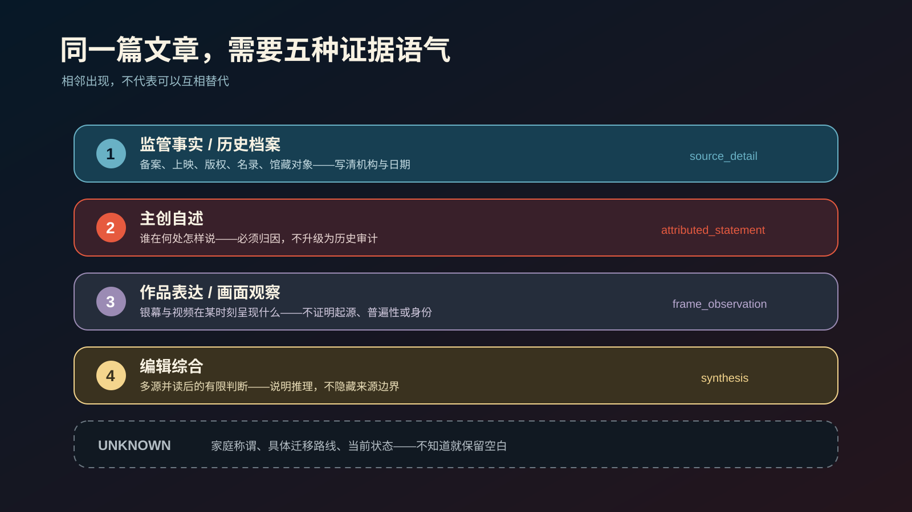
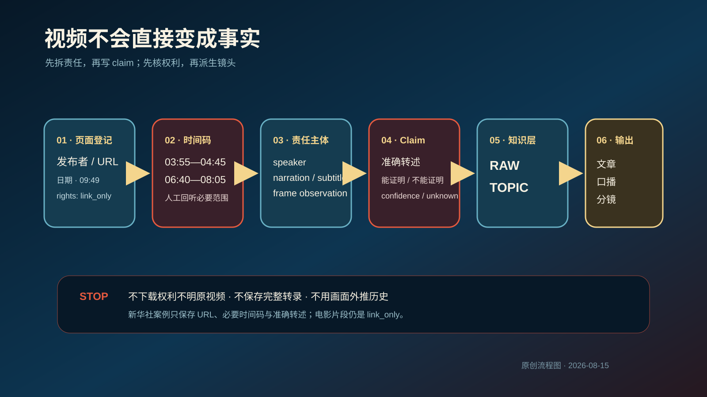

# 一封信，穿过海：《给阿嬷的情书》与潮汕家庭记忆

> **视觉说明：** 项目原创编辑插画，非历史照片、非电影剧照、非真实侨批复制件。电影、海报、剧照、片段、台词与音乐均未复制进仓库。

这是一篇由 `teochew-people-skill` 和公共 Wiki 生成、再经来源与权利审校的示范专题。文中使用五类标记：`source_detail` 是来源直接支持的事实，`attributed_statement` 是有明确说话者的陈述，`frame_observation` 只描述某段视频呈现了什么，`synthesis` 是多源并读后的有限判断，`unknown` 则保留公开材料回答不了的问题。核验日为 **2026-08-15**。

## 一封信，为何从阿嬷开始

一封信可以被电影写成悬念，也可以在档案馆里保持沉默。2023 年，国家电影局备案记录给出《给阿嬷的情书》的片名、备案号、备案单位、编剧和一个很短的故事骨架；到 2026 年 4 月 30 日，它进入院线上映。这里能够确认的是一部作品如何取得公开身份、进入传播，而不是它讲述的一切因此都变成历史。`source_detail`：`national-film-filing-letter-to-grandma-2023`、`ncac-film-copyright-warning-letter-to-grandma-2026`。

羊城晚报在上映前报道中列出潮语、侨批和汕头、潮州、揭阳等拍摄地域；国家电影局页面又记录 5 月 16—17 日的展映和 5 月 17 日座谈。三座城市首先是报道可核的取景节点，不等于三市的日常生活、口音和家庭关系都被一部电影完整代表。`source_detail`：`yangcheng-letter-to-grandma-2026`、`national-film-letter-to-grandma-2026`。

6 月 18 日，马来西亚 GSC 影片页列出潮语声音版本和马来文、中文、英文字幕；新加坡出现华语配音版与有限潮语原音放映，随后还有加场和对方言影视环境的讨论。时间线可以证明作品抵达了哪些公开节点，却不能替观众决定它意味着什么，更不能把某一时点的售票数字变成海外潮人的意见统计。`source_detail / synthesis`：`gsc-dear-you-malaysia-2026`、`zaobao-dear-you-dialect-discussion-2026`、`zaobao-dear-you-singapore-update-2026`。

> **图 1｜一封信进入公共空间。** 备案、上映、活动、报道和放映日期分别记录；截至 2026-08-15，图中只总结已经结束的节点，后续发行仍属 `unknown`。

标题里的“阿嬷”把读者带向家庭，但公开资料无法告诉我们：不同县区、家庭和代际是否都这样称呼长辈，当面称呼和书面表达是否相同，迁居海外之后又怎样变化。于是，这篇文章只把“阿嬷”当作片名和具体叙事入口，不把它扩写成一条全域规则。`unknown / varies`：待具体家庭和语言资料核对。

真正值得追问的不是“电影有多像历史”，而是：银幕上的信和档案里的侨批在哪里相遇，又在哪里分开？这条问题会把情感入口重新带回可核对的纸张、款项、递送网络和馆藏责任。`editorial_structure`。

## 侨批不是电影道具

在 UNESCO 世界记忆项目的名录说明中，侨批与银信相关材料不是一个浪漫意象，而是一组包含信件、汇款凭证、账簿和报告的文献。它们留下 19 至 20 世纪海外移民与中国家庭之间如何通信、如何传递钱款的证据。2013 年进入的是 UNESCO 世界记忆名录，不是世界遗产名录，也不是非物质文化遗产代表作名录。`source_detail`：`unesco-qiaopi-2013`。

广东省档案馆的馆藏故事把这种联系落到更具体的层面：寄件人、收件人、封套、汇款、批局和递送环节彼此相连。国家档案局 2020 年的报道又提供汕头馆藏征集、保护与数字化工作的一个时间截面。前者适合从一件档案进入人物与路由，后者适合观察库房、扫描和检索；两者都不能说明所有侨批，也不能让截至 2020 年的馆藏数字永久有效。`source_detail`：`gd-archives-qiaopi-story`、`china-archives-qiaopi-2020`。

> **图 2｜信、款、路、藏。** 原创对象图没有复制或仿造任何馆藏姓名、金额、地址、笔迹、邮戳或正文。具体故事必须回到获授权的单件档案。

电影可以把侨批变成叙事装置，但它必须承认“创作”这一层。蓝鸿春在人民日报署名材料中回忆团队访问东南亚长者、阅读侨批，再把许多故事碎片组合进剧本；澎湃的具名采访记录他如何从东南亚家庭走访、泰国华文报刊等材料中寻找人物与生活细节。它们能够支持“主创如何解释自己的资料过程”，不能把电影中的每封信认证为历史原件。`attributed_statement`：`peoples-daily-lan-hongchun-essay-2026`、`thepaper-lan-hongchun-interview-2026`。

这一区分对写作非常实际。如果要写一个真实侨批故事，应先取得具体档案编号、寄收双方、日期、金额、路由与图像使用许可；如果要分析电影，则写明“主创从多类材料中选择和重组”。两种文章都可以动人，但它们对证据负有不同责任。`synthesis`。

对视频生产也是如此。没有档案授权时，可以拍原创对象图、地图、扫描流程示意和空白信纸；不能让模型仿造一封“最感人的侨批”，再用旧纸纹和邮戳把它包装成实物。档案的力量不来自泛黄滤镜，而来自它确实属于某个时间、某条路线和某些具体的人。`production_boundary`。

## 家如何成为一种声音

广东省地方志办公室把潮州话、潮语、潮汕话列为公共语境中的常见名称，也把使用范围放到粤东不同地方和东南亚潮人聚集地；同一页同时提醒，各地语音存在差别。这意味着声音从来带着地点、家庭、代际与迁移环境，不能被一个配音者或一部电影压成单一“标准家乡话”。`source_detail`：`gd-dfz-teochew-language-2020`。

语言进入电影制作，还会多出另一层责任。新华社 2026 年 5 月 16 日发布的导演专访长 9 分 49 秒。在约 `00:06:40–00:08:05` 的人工核验范围里，蓝鸿春谈到把剧本译成泰文、用发音标记协助演员学习台词，并反复处理语言细节。这个片段能够说明该片跨语言表演准备的一种方法；它不能证明演员的母语身份，也不能把片中发音定为全域标准。`attributed_statement`：`xinhua-letter-to-grandma-video-2026`。

当影片抵达海外，语言又不只属于拍摄现场。马来西亚院线页面把它列为潮语声音、配多语字幕；新加坡的放映则出现原音、配音、特设场次、审批和加场。这里并非简单的“乡音被保留”或“乡音被改变”，而是一连串具体选择：谁能听原音、谁依赖字幕、哪些场次可以安排、报道在什么时点记录了状态。`source_detail / synthesis`：`gsc-dear-you-malaysia-2026`、`zaobao-dear-you-dialect-discussion-2026`。

如果把这一段做成视频，不应截取电影对白来证明“潮语有多美”，也不应用一个口音测试观众是否“够潮汕”。更好的制作方式，是邀请获得同意的具名说话者，在明确地点与家庭背景下朗读自己选择的无版权日常短句；字幕只展示差异，不排高低。影片版本则用原创“原音／配音／字幕”图说明传播条件。`editorial_visual / local_check`。

## 三座城市与一条跨海路线

一张地图最容易制造确定感。影片报道列出汕头、潮州、揭阳，于是三座城市可以成为取景图层；侨批和会馆资料连接原乡与海外，于是又出现历史关系图层；2026 年马来西亚、新加坡的上映与加场，则属于当代放映图层。如果把三层混成一条箭头，读者会误以为电影取景地就是某个家族的出发地，海外影院就是历史迁徙的终点。

> **图 3｜三种地理。** 原创编辑示意，非比例地图、非单一家族迁徙路线。取景节点来自 `yangcheng-letter-to-grandma-2026`；历史联系回到 `unesco-qiaopi-2013` 与会馆资料；马新节点只代表 2026 年公开放映记录。

当代汕潮揭都市圈规划可以帮助我们固定今日三市的政策与行政协同范围，却不能反过来定义所有历史文化身份。八邑会馆资料可以说明一个具名组织如何讲述自身来源与联络范围，也不能变成全球潮人的统一组织标准。地图因此选择“节点＋线型＋图例”，不画虚构航线，不标没有来源的家庭姓氏。`source_detail / editorial_visual`：`gd-chaoshan-metropolitan-plan-2023`、`teochew-huay-kuan-history`、`nlb-teochew-huay-kuan`。

影片主创材料中的泰国、马来西亚、越南走访，是创作调研范围；GSC 与联合早报页面里的马来西亚、新加坡，则是后续传播范围。两个范围可以在文章里相遇，但不应被写成“电影完整代表了东南亚华人”。东南亚不是一块同质背景，各国政策、语言、社群组织和家庭历史都不同。`attributed_statement / source_detail / boundary`。

对有真实背景的读者，这张地图还故意留出一个空位：你家的路线在哪里？它涉及哪一代、哪个年代、哪个具体地点，是否经历多次迁移？没有本人或档案回答之前，公共文章不替任何家庭补上一条“下南洋”的标准路径。`unknown / local_overlay`。

## 电影如何重构真实

“根据真实故事”常被理解为一枚印章，仿佛作品里的物件、年代和情感都因此得到认证。更可靠的方法，是把同一篇文章中的材料拆成五层：监管事实与历史档案、主创自述、作品表达与画面观察、编辑综合，以及不知道的部分。它们可以并排出现，却不能互相代替。

> **图 4｜五种证据语气。** 原创方法图不对电影真实性、历史价值或观众意见作量化评分。

第一层最窄也最稳。备案页说明影片在备案阶段的身份；版权预警说明所列权利人、上映日和未经许可不得网络传播；UNESCO 与档案机构说明侨批材料的名录、对象和保存。它们分别回答“这是什么记录”，不会替作品评价。`source_detail`。

第二层必须带人名。导演在署名文章、采访和视频中谈调研、阅读、写作与表演准备，这些都是可使用的创作资料，但句子的主语不能从“蓝鸿春说”悄悄换成“历史证明”。主创最有资格解释自己的选择，却不是自己作品的外部真实性审计者。`attributed_statement`。

第三层最容易越界。新华社视频既有导演受访，也插入了电影片段。约 `00:05:35–00:06:15` 的受访段可以转述导演对拍摄中继续形成故事关系的说明；紧邻的影片画面，只能记成“视频在这个时间码展示了作品片段”。看见一件衣服、一个房间或一个动作，不足以推出它的历史起源、普遍程度、人物身份或真实地点。`speaker_claim / frame_observation`：`xinhua-letter-to-grandma-video-2026`。

> **图 5｜视频转 Wiki。** 原视频保持 `link_only`。本库没有保存 MP4、截图、音轨或完整逐字稿，只保存 URL、时长、必要时间码和准确转述。

视频链路从权利开始，而不是从下载开始。先登记原发布者、URL、日期、时长和 `rights_status`；再只转录任务所需范围，把 `speaker`、`narration`、`subtitle` 与 `frame_observation` 分开；每条 claim 写明能证明什么、不能证明什么；最后才进入 raw、topic 和派生脚本。自动转录里的潮语、人名和地名，未经人工回听保持 `unknown`。

这条链路也解释了本专题为何没有电影剧照。国家版权预警页面明确提出未经许可不得在网络上提供或允许上传该片。即使报道页和视频页能公开访问，也不等于本仓库获得复制、裁切或再分发的许可。因此，读者看到的是原创插画、时间线、地图和图表；影片材料保留为可追踪的普通链接。`production_boundary`：`ncac-film-copyright-warning-letter-to-grandma-2026`。

第四层是编辑综合。比如“乡音在海外发行中会被字幕、配音和场次重新安排”，来自 GSC 与联合早报页面的并读；它不是任何一个来源的原句，也不是永恒规律。综合判断应让读者看得见推理路径，并允许未来材料修正它。`synthesis`。

第五层是留白。电影最终全球发行、2026-08-15 之后的票房和放映政策、具体家庭与电影细节的吻合程度，都不能因为文章需要一个结论就被填满。一个会保留 `unknown` 的 Wiki，比一个处处给出肯定答案的资料库更适合长期生长。

## 仍需当地人回答的部分

公共来源已经能搭起一条可靠骨架：作品怎样备案和上映，侨批是什么档案，潮语为什么需要地方边界，马来西亚与新加坡在何时出现了哪些放映节点，主创如何描述自己的资料过程。真正决定文章有没有生活质地的，却是骨架外的具体经验。

第一组问题是称谓。哪一个县区、家庭和代际使用“阿嬷”？当面称呼、对外叙述和书面写法是否一样？迁居海外以后，称谓是否与当地语言并存？在没有具体回答之前，正文只说明影片标题，不把一种说法推广到全部家庭。`unknown / varies`。

第二组问题是时间与路线。一个家庭的跨海经历属于哪一代、哪个年代、从哪里到哪里？是一次出发，还是经历回乡、再迁移和家庭分支？侨批、照片、口述与机构档案能否互相对上？如果答案只来自记忆，就保留“受访者回忆”的归因，不把它写成没有误差的年代记录。`local_overlay / attributed_statement`。

第三组问题是银幕与生活。电影里的说话节奏、衣食住行、寄收信方式和家庭互动，哪些让人觉得熟悉，哪些因地方、年代、经济条件而不同，哪些明显服务于戏剧结构？真实背景最有价值的作用不是为电影盖章，而是指出公共资料在哪里说得太宽、漏掉了什么。

最后是授权。旧信、照片、录音和视频分别选择：实名公开、匿名公开、只供内部校对、完全不留存。即使允许公开，也要处理地址、账号、未同意亲属身份和其他个人信息；生活经验进入公共 raw 时带地点、年代、身份边界和 C 级属性，不替代档案、法规或统计。

这正是 TEOCHEW PEOPLE 的价值：不是把更多材料一股脑塞给模型，而是精挑细选输入，保留细节、归因、时间码、权利和未知，让后续文章、口播、分镜、配图与审校都能沿同一证据链继续工作。

### 来源索引

| 主题 | Raw 来源 |
| --- | --- |
| 影片备案与版权 | [`national-film-filing-letter-to-grandma-2023`](../skills/teochew-people-skill/raw/2026-08-15/national-film-filing-letter-to-grandma-2023.md)、[`ncac-film-copyright-warning-letter-to-grandma-2026`](../skills/teochew-people-skill/raw/2026-08-15/ncac-film-copyright-warning-letter-to-grandma-2026.md) |
| 中国上映、展映与座谈 | [`yangcheng-letter-to-grandma-2026`](../skills/teochew-people-skill/raw/2026-08-15/yangcheng-letter-to-grandma-2026.md)、[`national-film-letter-to-grandma-2026`](../skills/teochew-people-skill/raw/2026-08-15/national-film-letter-to-grandma-2026.md) |
| 主创署名、采访与视频 | [`peoples-daily-lan-hongchun-essay-2026`](../skills/teochew-people-skill/raw/2026-08-15/peoples-daily-lan-hongchun-essay-2026.md)、[`thepaper-lan-hongchun-interview-2026`](../skills/teochew-people-skill/raw/2026-08-15/thepaper-lan-hongchun-interview-2026.md)、[`xinhua-letter-to-grandma-video-2026`](../skills/teochew-people-skill/raw/2026-08-15/xinhua-letter-to-grandma-video-2026.md) |
| 侨批档案 | [`unesco-qiaopi-2013`](../skills/teochew-people-skill/raw/2026-08-15/unesco-qiaopi-2013.md)、[`gd-archives-qiaopi-story`](../skills/teochew-people-skill/raw/2026-08-15/gd-archives-qiaopi-story.md)、[`china-archives-qiaopi-2020`](../skills/teochew-people-skill/raw/2026-08-15/china-archives-qiaopi-2020.md) |
| 潮语边界 | [`gd-dfz-teochew-language-2020`](../skills/teochew-people-skill/raw/2026-08-15/gd-dfz-teochew-language-2020.md) |
| 马来西亚与新加坡传播 | [`gsc-dear-you-malaysia-2026`](../skills/teochew-people-skill/raw/2026-08-15/gsc-dear-you-malaysia-2026.md)、[`zaobao-dear-you-dialect-discussion-2026`](../skills/teochew-people-skill/raw/2026-08-15/zaobao-dear-you-dialect-discussion-2026.md)、[`zaobao-dear-you-singapore-update-2026`](../skills/teochew-people-skill/raw/2026-08-15/zaobao-dear-you-singapore-update-2026.md) |

### 权利状态

- 电影、海报、剧照、片段、台词、音乐、新华社视频、新闻和档案图片：`link_only`。
- 本文 6 个本地视觉：`editorial_original`，详见 [`assets/media-manifest.json`](../assets/media-manifest.json)。
- 用户照片、信件、录音与视频：没有逐项授权前不进入公共仓库。

### 继续生产

- [60 秒与约 3 分钟脚本](./letter-to-grandma-video-scripts.md)
- [新华社视频转 Wiki 完整演示](./video-to-wiki-demo.md)
- [电影事件 topic](../skills/teochew-people-skill/wiki/current-events/给阿嬷的情书-2026.md)
- [视频素材转 Wiki 指南](../skills/teochew-people-skill/wiki/guides/视频素材转Wiki.md)
